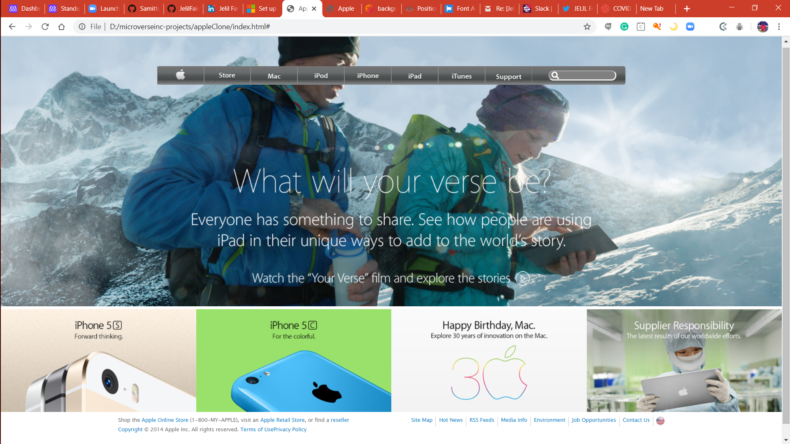

# AppleClone(Old Apple Homepage)

An Example Repo for microverse Projects path as a mockup of New-York Times article page.

Screenshot of Page

 

## Built With

- Html,
- Css
- Grid Module
- Flexbox
- Linter validator

[Live Demo Link](https://raw.githack.com/JelilFaisalAbudu/appleClone/homepage/index.html)

## About
An Example Repo for microverse Projects path as a mockup of [Old Apple site homepage](https://web.archive.org/web/20140301004610/http://www.apple.com/). 
It contains an exact copy of the layout, and similar and the same user experience.

The main purpose of this project is to learn and also to acquire the technical skills positoning and gradient.

Therefore one is required to apply css float, flexbox and grid to as the techniques to lay out the page.

## Authors

👤 **Jelil Faisal Abudu**

- Github: [@githubhandle](https://github.com/JelilFaisalAbudu)
- Twitter: [@twitterhandle](https://twitter.com/jelilabudu)
- Linkedin: [linkedin](https://www.linkedin.com/in/jelil-faisal-abudu-3b7a2182/)

## 🤝 Contributing

Contributions, issues and feature requests are welcome!

Feel free to check the [issues page](       ).

## Show your support

Give a ⭐️ if you like this project!

